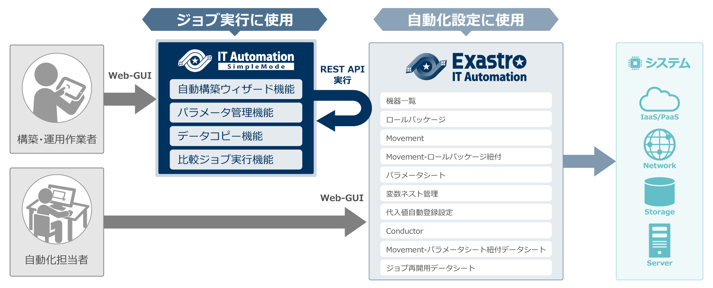

<link rel="stylesheet" href="./assets/css/software_article.css?v=3">

<header id="header">

    
Exastro IT Automation

    <h1 class="header-h1">SimpleMode</h1>
    
SimpleModeは、Exastro IT Automationの⼀部の機能を簡単に使⽤するためのラッパーツールです。

</header>

<main id="main">
<nav id="contents-menu">
    <ul class="contents-menu-list">
        <li class="contents-menu-item"><a href="#install" class="touch anker">インストール⽅法 <i class="fas fa-angle-down"></i></a></li>
        <li class="contents-menu-item"><a href="#about" class="touch anker">SimpleModeとは <i class="fas fa-angle-down"></i></a></li>
        <li class="contents-menu-item"><a href="#use-cases" class="touch anker">ユースケース <i class="fas fa-angle-down"></i></a></li>
    </ul>
</nav>
<article class="article">

<section id="install" class="section">
    

        

            <h2 class="section-h2">インストール⽅法</h2>
            

                

                    
公開リポジトリのREADMEをご確認ください。 
                    <a href="https://github.com/exastro-suite/exastro-it-automation-simplemode" target="_blank" class="touch">https://github.com/exastro-suite/exastro-it-automation-simplemode</a>

                

            

        

    

</section>

<section id="about" class="section">
    

        

            <h2 class="section-h2"><strong class="software-name">IT Automation SimpleMode</strong>とは︖</h2>
            

                

                    
Exastro IT Automationが提供する機能のうち、シンプルなユースケースに有⽤な機能を簡単に利⽤できるWebGUIを提供します。 ラッパーツールとしてExastro IT AutomationのREST APIと連携することで、⾃動構築をウィザード形式でサポートします。 また、SimpleMode特有の機能としてパラメータシート間でのデータコピー機能を提供し、例えば実環境から収集したパラメータを設定変更⽤のパラメータとして簡単に再利⽤することが可能です。

                

                

                    <figure class="loupe touch"></figure>
                

            

            <h3 class="section-h3">機能</h3>
            

                

                    <h4 class="section-h4">⾃動構築ウィザード機能</h4>
                    
ウィザード形式でAnsible Movementを実⾏できます。 
                    ※ 実⾏するMovementは予めExastro IT Automationに設定しておく必要があります。

                    <figure class="loupe touch"></figure>
                

                

                    <h4 class="section-h4">スプレッドシート形式のパラメータ管理機能</h4>
                    
スプレッドシート形式で、パラメータの参照・編集が可能です。

                    <figure class="loupe touch"></figure>
                

                

                    <h4 class="section-h4">パラメータシート間のデータコピー機能</h4>
                    
異なるパラメータシート間で、データのコピーが可能です。 
                    （パラメータシートのカラム構成が同じものが対象）

                    <figure class="loupe touch"></figure>
                

                

                    <h4 class="section-h4">⽐較ジョブ実⾏ウィザード機能</h4>
                    
パラメータ⽐較機能をウィザード機能で⼀括で実⾏できます。

                    <figure class="loupe touch"></figure>
                

            

        

    

</section>

<section id="use-cases" class="section">
    

        

            <h2 class="section-h2">ユースケース</h2>
            

                

                    <h3 class="section-h3">Exastro IT Automationの⼊⾨⽤に</h3>
                    
Exastro IT Automationを初めて使⽤するユーザーが⾃動構築を始める際に、SimpleModeは有⽤です。 ⾃動化の担当者があらかじめ設定した⾃動化を、作業者がSimpleModeを通じてウィザード形式で実⾏できます。 初めての利⽤でも、パラメータの登録や再利⽤、Movement（作業パターン）の選択に際しての迷いが軽減されます。

                

                

                    <h3 class="section-h3">テンプレートを使ってOS構築から⾃動化をスタート</h3>
                    
繰り返し実⾏する機会の多いOSの設定作業をSimpleModeで⾃動化できます。 「Exastro Playbook Collection」として提供されるAnsible Role Templateをインポートすることで、サーバーOSのパラメータ収集、設定変更、パラメータ⽐較も可能な⾃動化を実現できます。

                

                

                    <h3 class="section-h3">構築済環境のOS設定確認に</h3>
                    
「Exastro Playbook Collection」のAnsible Role Template内の収集ジョブを使⽤することで、既に構築されている環境からパラメータを収集できます。 収集結果を基に設定ミスや漏れをチェックでき、⽐較機能を活⽤することで過去のパラメータとの差分抽出も⾏えます。

                    
Exastro Playbook Collection はこちらからダウンロードいただけます。 
                    <a href="https://github.com/exastro-suite/playbook-collection-docs/blob/master/README.ja.md" target="_blank" class="touch">https://github.com/exastro-suite/playbook-collection-docs/blob/master/README.ja.md</a>

                

            

        

    

</section>

</article>
</main>